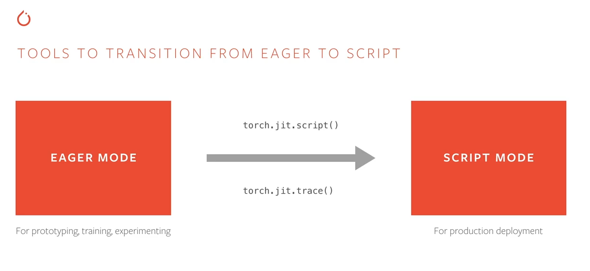

# Serving a Pytorch model by using TorchServe

This Document For Debian Based Systems/ MacOS

For Windows follow the document from [torchserve](https://github.com/pytorch/serve#install-torchserve-and-torch-model-archiver)

## Contents of this Document

* [Install TorchServe](#installation)
* [Serve a Model](#serve-a-model)
* [Two mode of Torch Model](#two-mode-of-torch-model)

## I. Installation
 1. Clone TorchServe repository
```shell
git clone https://github.com/pytorch/serve.git
```
 2. Install all dependencies:
 
    Note: For Conda, Python 3.8 is required to run Torchserve.

   - Change to *serve* directory
     
     ```bash
     cd serve
     ```       
    
   - For CPU

        ```bash
        python ./ts_scripts/install_dependencies.py
        ```
        
   - For GPU with Cuda 10.2. Options are `cu92`, `cu101`, `cu102`, `cu111`

       ```bash
       python ./ts_scripts/install_dependencies.py --cuda=cu102
       ```
 3. Install torchserve, torch-model-archiver and torch-workflow-archiver
   For Conda
   ```
   conda install torchserve torch-model-archiver torch-workflow-archiver -c pytorch
   ```
   
   For Pip
   ```
   pip install torchserve torch-model-archiver torch-workflow-archiver
   ```
### Install TorchServe for development at [here](https://github.com/pytorch/serve#install-torchserve-for-development)
 
## II. Serve a model
#### 1. Run an example from github
   ##### 1.1 Change to the parent directory of the *serve* directory
   
   ```bash
   cd ..
   ```
   ##### 1.2 Create a folder to store your models
   
   ```bash
   mkdir model_store
   ```
   ##### 1.3 Download a trained model
   
   ```bash
    wget https://download.pytorch.org/models/densenet161-8d451a50.pth
   ```
   ##### 1.4 Archive the model by using the model archiver.
   
   ```bash
    torch-model-archiver --model-name densenet161 --version 1.0 --model-file ./serve/examples/image_classifier/densenet_161/model.py --serialized-file densenet161-8d451a50.pth --export-path model_store --extra-files ./serve/examples/image_classifier/index_to_name.json --handler image_classifier

   ```
   [Here](https://github.com/pytorch/serve/blob/master/model-archiver/README.md) for more informations about arguments.
   
   ###### Note: Pytorch model include 2 mode: eager mode and script mode. To know more about mode in Pytorch click [here]()
  
  ##### 1.5 Start TorchServe to serve the model
  ```bash
    torchserve --start --ncs --model-store model_store --models densenet161.mar
   ```
  ##### 1.6 Get predictions from a model
  
  1.6.1 Using GRPC APIs through python client
     
   - Install grpc python dependencies :
   
     ```bash
     pip install -U grpcio protobuf grpcio-tools
     ```
   - Change directory to the *serve* directory :
   
     ```bash
     cd serve
     ```
   - Generate inference client using proto files
   
     ```bash
     python -m grpc_tools.protoc --proto_path=frontend/server/src/main/resources/proto/ --python_out=ts_scripts --grpc_python_out=ts_scripts   
     frontend/server/src/main/resources/proto/inference.proto frontend/server/src/main/resources/proto/management.proto
     ```
   - Run inference using a sample client [gRPC python client](https://github.com/pytorch/serve/blob/master/ts_scripts/torchserve_grpc_client.py)
   
     Note: Remember to [Start TorchServe](#15-start-torchserve-to-serve-the-model) before running this command. 
   
     ```bash
     python ts_scripts/torchserve_grpc_client.py infer densenet161 examples/image_classifier/kitten.jpg
     ```
  1.6.2 Using REST APIs
  
   - Download an image to test the model server (you also can use your own data).
   
     
     
     ```bash
     curl -O https://raw.githubusercontent.com/pytorch/serve/master/docs/images/kitten_small.jpg
     ```
   - The first way, we can use terminal to get prediction:
   
     ```bash
     curl http://127.0.0.1:8080/predictions/densenet161 -T kitten_small.jpg
     ```
   
   - The other way, we implement [a python script](send_request.py) to get a prediction:
   
     ```bash
     python send_request.py
     ```
   
 ##### 1.7 Deploy multi model
 
 ##### Add new model when server is working
  
 
 1.7.1 Register a model
   ###### FOR gRPC API
    
   ```bash
     python ts_scripts/torchserve_grpc_client.py register squeezenet1_1
   ```
   By example code we only can use some pretrained model. 
   
   ###### FOR REST API
   
   Create a mar file of the second model store in the *model_store* folder. And set several workers for the second model.  
   
   Example: If we have a *squeezenet1_1.mar* in *model_store*. Use this following code: 
   
   ```bash
   curl -v -X POST "http://localhost:8081/models?initial_workers=1&url=squeezenet1_1.mar"
   ```
  
  Or you can download a pretrained model from Torch Serve.
  
  ```bash
  curl -v -X POST "http://localhost:8081/models?initial_workers=1&url=https://torchserve.pytorch.org/mar_files/squeezenet1_1.mar"
  ```
  
  If you want to update a new version of model (example version 1.1):
  
  ```bash
  curl -v -X POST "http://localhost:8081/models?initial_workers=1&url=squeezenet1_1.mar/1.1"
  ```
  

  
###### Parameters
```
 url: Load a model archive. Supports the following locations:

    a local model archive (.mar); the file must be in the model_store folder (and not in a subfolder).

    a URI using the HTTP(s) protocol. TorchServe can download .mar files from the Internet.


 model_name: Name of a mar model file.


 handler: Make sure that the given handler is in the PYTHONPATH. Format: module_name: method_name


 runtime: The runtime for the model custom service code. Default PYTHON


 batch_size: The inference batch size.  Default 1


 max_batch_delay: This is the maximum batch delay time TorchServe waits to receive batch_size number of requests. 
                  Default 100 ms


 initial_workers: The number of initial workers to create. 
                  TorchServe will not run inference when initial_workers=0. Default 0


 synchronous: Whether or not the creation of worker is synchronous. Default false


 response_timeout: Timeout, in seconds, maximum time for model’s backend workers process a request. 
                   Raise Error 500 if no response. Default 120 s
```
  1.7.2 Cancel a model registration.

   ###### FOR gRPC API
    
   ```bash
     python ts_scripts/torchserve_grpc_client.py unregister squeezenet1_1
   ```
   ###### FOR REST API

   ```bash
   curl -X DELETE http://localhost:8081/models/squeezenet1_1/1.0
   ```
 
##### Add multiple models by torchserve command

  Use torchsever --stop if the server is running. After that run this command.
  
  ```
  torchserve --start --ncs --model-store model_store --models model1 model2 
  ```
###### Arguments

  ```
  --start               Start the model-server
  

  --stop                Stop the model-server


  --ts-config TS_CONFIG
                        Configuration file for model server


  --no-config-snapshots, --ncs
                        Prevents to server from storing config snapshot files.


  --models              Load models. There are some options:

            standalone: default: N/A, No models are loaded at start up.

            all: Load all models present in model_store.

            model1.mar, model2.mar: Load models in the specified MAR files from model_store.

            model1=model1.mar, model2=model2.mar: Load models with the specified names and MAR files from model_store.
  ```
  
### III.CONVERT TO SCRIPT MODE
  
  
  A PyTorch model has two mode. There are Eager Mode and Script Mode. 
  
  A short explanation about those is Eager Mode always use for training model, and Script Mode use for production. Script Mode helps model portability and more 
  performance. See the image below.
  
  
  
  For more informations about [Script Mode](https://stackoverflow.com/questions/53900396/what-are-torch-scripts-in-pytorch)
  
###  Eager mode:

   - In particularly, we save a model by torch.save that means you save the model in eager mode. 
  
   - Like the way we did before to [archive a model](#14-archive-the-model-by-using-the-model-archiver) in eager model we need to create a python file containing model architecture and pass through the --model-file argument. 
   
   - To archive a custom model we need to save the model in script mode by using two methods: torch.jit.trace or torch.jit.script. 
  
### 1. Tracing a model:

 The way to convert from eager mode to script mode by torch.jit.trace: 
 
 - Take an existing eager mode, and provide example inputs.
 
 - The tracer runs the function, recording the tensorflow operations performed.
 
 We turn recording into a Script Module.
 
 - Can reuse eager model code.
 - Control-flow an data structures are ignored. (That means it doesn't work well with if statements or for loops).
 
 Try to use torch.jit.trace [here](https://colab.research.google.com/drive/1m-FVJRgAwPycniqlKoNwQs0JvmZXRymq?usp=sharing).

### IV.REFERENCES


 [TorchServe, công cụ hỗ trợ triển khai mô hình PyTorch.](https://viblo.asia/p/torchserve-cong-cu-ho-tro-trien-khai-mo-hinh-pytorch-vyDZOqwO5wj)
 
 [Model Serving on Pytorch.](https://github.com/pytorch/serve)
 
 [TorchScript and PyTorch JIT | Deep Dive.](https://www.youtube.com/watch?v=2awmrMRf0dA)
 
 [What are Torch Scripts in PyTorch?.](https://stackoverflow.com/questions/53900396/what-are-torch-scripts-in-pytorch)
 
 
