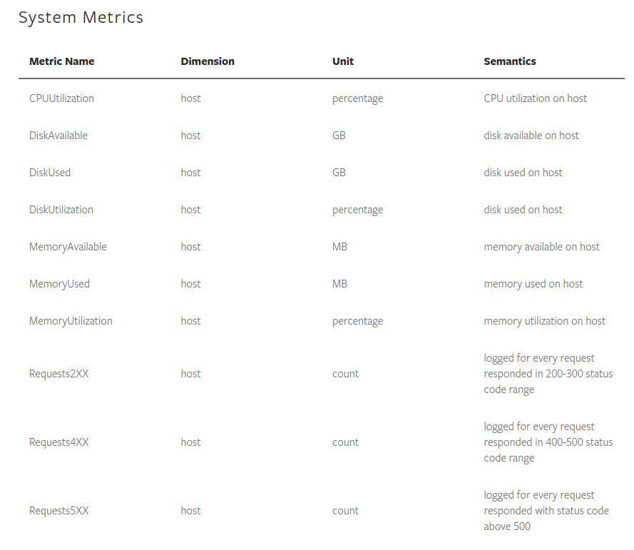

# Serving a Pytorch model by using TorchServe

This Document For Debian Based Systems/ MacOS

For Windows follow the document from [torchserve](https://github.com/pytorch/serve#install-torchserve-and-torch-model-archiver)

## Contents of this Document

* [Install TorchServe](#i-installation)
* [Serve a Model](#ii-serve-a-model)
* [Logging and Monitoring](#iii-logging-and-monitoring)
* [Metrics](#iv-metrics)
* [Convert to Script Mode](#v-convert-to-script-mode)
* [Serve YOLOv5 Model](#vi-serve-yolov5-model)
* [Common Bugs](#vii-common-bugs)
* [References](#viii-references)

## I. Installation
 1. Clone TorchServe repository
```shell
$ git clone https://github.com/pytorch/serve.git
```
 2. Install all dependencies:
 
    Note: For Conda, Python 3.8 is required to run Torchserve.

   - Change to *serve* directory
     
     ```bash
     $ cd serve
     ```       
    
   - For CPU

        ```bash
        $ python ./ts_scripts/install_dependencies.py
        ```
        
   - For GPU with Cuda 10.2. Options are `cu92`, `cu101`, `cu102`, `cu111`

       ```bash
       $ python ./ts_scripts/install_dependencies.py --cuda=cu102
       ```
 3. Install torchserve, torch-model-archiver and torch-workflow-archiver
 
   For Conda
   ```
   $ conda install torchserve torch-model-archiver torch-workflow-archiver -c pytorch
   ```
   
   For Pip
   ```
   $ pip install torchserve torch-model-archiver torch-workflow-archiver
   ```
   
   #### NOTE: 
   If this command raise a warning that these libraries is not in PATH looks like the following warning. 
   
   ```
   WARNING: The script torchserve is installed in '/home/user/.local/bin' which is not on PATH.
   ```
   You must add root directory path of these libraries. For example: 
   
   ```
   export PATH=$PATH:/home/user/.local/bin
   ```
### Install TorchServe for development at [here](https://github.com/pytorch/serve#install-torchserve-for-development)
 
## II. Serve a model
### 1. Run an example from github
   #### 1.1 Change to the parent directory of the *serve* directory
   
   ```bash
   $ cd ..
   ```
   #### 1.2 Create a folder to store your models
   
   ```bash
   $ mkdir model_store
   ```
   #### 1.3 Download a trained model
   
   ```bash
   $ wget https://download.pytorch.org/models/densenet161-8d451a50.pth
   ```
   
   ##### Note: Pytorch model include 2 mode: eager mode and script mode. To know more about mode in Pytorch click [here](#5-convert-to-script-mode)
   
   #### 1.4 Archive the model by using the model archiver.
   
   ```bash
   $ torch-model-archiver --model-name densenet161 --version 1.0 --model-file ./serve/examples/image_classifier/densenet_161/model.py --serialized-file densenet161-8d451a50.pth --export-path model_store --extra-files ./serve/examples/image_classifier/index_to_name.json --handler image_classifier

   ```
   [Here](https://github.com/pytorch/serve/blob/master/model-archiver/README.md) for more informations about arguments.
   
  
  #### 1.5 Start TorchServe to serve the model
  
  1.5.1 Configure properties:
  
   The defaul port of Inference REST API - 8080, Management REST API - 8081, Metrics REST API - 8082.
   Inference gRPC API - 7070, Management gRPC API - 7071.

   In my case, port 7070 is already used by AnyDesk. So I have to configure gRPC port:

   ```bash
   $ echo "grpc_inference_port=8888" > config.properties
   ```

   Torch Serve will load configurations from file config.properties where you run *tochserve*.

   For more [Advanced Configuration](Advanced_Configuration.md)
  
  1.5.2 Start TorchServe:
  
  ```bash
  $ torchserve --start --ncs --model-store model_store --models densenet161.mar
  ```
  
  After you execute the torchserve command above, TorchServe runs on your host, listening for inference requests.
  
  #### 1.6 Get predictions from a model
  
  1.6.1 Using GRPC APIs through python client
     
   - Install grpc python dependencies :
   
     ```bash
     $ pip install -U grpcio protobuf grpcio-tools
     ```
   - Change directory to the *serve* directory :
   
     ```bash
     $ cd serve
     ```
   - Generate inference client using proto files 
   
     ```bash
     $ python -m grpc_tools.protoc --proto_path=frontend/server/src/main/resources/proto/ --python_out=ts_scripts --grpc_python_out=ts_scripts   
     frontend/server/src/main/resources/proto/inference.proto frontend/server/src/main/resources/proto/management.proto
     ```
     
     This command will create 4 python files: *inference_pb2.py, inference_pb2_grpc.py, management_pb2.py, management_pb2_grpc.py* depend on *grpc_tools.protoc* file.
     
   - Run inference using a sample client [gRPC python client](https://github.com/pytorch/serve/blob/master/ts_scripts/torchserve_grpc_client.py)
   
     ##### Note: 
     Remember to [Start TorchServe](#15-start-torchserve-to-serve-the-model) before running this command. Change inference port from 7070 to 8888 if you set *grpc_inference_port=8888* in line 10 of *torchserve_grpc_client.py*.
   
     ```bash
     $ python ts_scripts/torchserve_grpc_client.py infer densenet161 examples/image_classifier/kitten.jpg
     ```
     
     ##### Arguments:
     
      - 1-> api name [infer, register, unregister]
      
      - 2-> model name
      
      - 3-> model input for prediction
      
  1.6.2 Using REST APIs
  
   - Download an image to test the model server (you also can use your own data).
   
     
     
     ```bash
     $ curl -O https://raw.githubusercontent.com/pytorch/serve/master/docs/images/kitten_small.jpg
     ```
   - The first way, we can use terminal to get prediction:
   
     ```bash
     $ curl http://127.0.0.1:8080/predictions/densenet161 -T kitten_small.jpg
     ```
   
   - The other way, we implement [a python script](send_request.py) to get a prediction:
   
     ```bash
     $ python send_request.py
     ```
   
 #### 1.7 Deploy multi model
 
 ##### Add new model when server is working
  
 
 1.7.1 Register a model
   ##### FOR gRPC API
    
   ```bash
   $ python ts_scripts/torchserve_grpc_client.py register squeezenet1_1
   ```
   By example code we only can use some pretrained model. 
   
   ##### FOR REST API
   
   Create a mar file of the second model store in the *model_store* folder. And set several workers for the second model.  
   
   Example: If we have a *squeezenet1_1.mar* in *model_store*. Use this following code: 
   
   ```bash
   $ curl -v -X POST "http://localhost:8081/models?initial_workers=1&url=squeezenet1_1.mar"
   ```
  
  Or you can download a pretrained model from Torch Serve.
  
  ```bash
  $ curl -v -X POST "http://localhost:8081/models?initial_workers=1&url=https://torchserve.pytorch.org/mar_files/squeezenet1_1.mar"
  ```
  
  If you want to update a new version of model (example version 1.1):
  
  ```bash
  $ curl -v -X POST "http://localhost:8081/models?initial_workers=1&url=squeezenet1_1.mar/1.1"
  ```
  

  
###### Parameters
```
 url: Load a model archive. Supports the following locations:

    a local model archive (.mar); the file must be in the model_store folder (and not in a subfolder).

    a URI using the HTTP(s) protocol. TorchServe can download .mar files from the Internet.


 model_name: Name of a mar model file.


 handler: Make sure that the given handler is in the PYTHONPATH. Format: module_name: method_name


 runtime: The runtime for the model custom service code. Default PYTHON


 batch_size: The inference batch size.  Default 1


 max_batch_delay: This is the maximum batch delay time TorchServe waits to receive batch_size number of requests. 
                  Default 100 ms


 initial_workers: The number of initial workers to create. 
                  TorchServe will not run inference when initial_workers=0. Default 0


 synchronous: Whether or not the creation of worker is synchronous. Default false


 response_timeout: Timeout, in seconds, maximum time for model’s backend workers process a request. 
                   Raise Error 500 if no response. Default 120 s
```
  1.7.2 Cancel a model registration.

   ##### FOR gRPC API
    
   ```bash
   $ python ts_scripts/torchserve_grpc_client.py unregister squeezenet1_1
   ```
   ##### FOR REST API

   ```bash
   $ curl -X DELETE http://localhost:8081/models/squeezenet1_1/1.0
   ```
 
##### Add multiple models by torchserve command

  Use torchsever --stop if the server is running. After that run this command.
  
  ```
  $ torchserve --start --ncs --model-store model_store --models model1 model2 
  ```
###### Arguments

  ```
  --start               Start the model-server
  

  --stop                Stop the model-server


  --ts-config TS_CONFIG
                        Configuration file for model server


  --no-config-snapshots, --ncs
                        Prevents to server from storing config snapshot files.


  --models              Load models. There are some options:

            standalone: default: N/A, No models are loaded at start up.

            all: Load all models present in model_store.

            model1.mar, model2.mar: Load models in the specified MAR files from model_store.

            model1=model1.mar, model2=model2.mar: Load models with the specified names and MAR files from model_store.
  ```
  
## III. LOGGING AND MONITORING

#### Types of logs

TorchServe currently provides the following types of logs

   - Access logs
   
   - TorchServe logs

### 1.Access Logs:

- When you load TorchServe with a model and run inference against the server, the following logs are collected into the access_log.log:

  ```
   2018-10-15 13:56:18,976 [INFO ] BackendWorker-9000 ACCESS_LOG - /127.0.0.1:64003 "POST /predictions/resnet-18 HTTP/1.1" 200 118
   ```

-The above log tells us that a successful POST call to /predictions/resnet-18 was made by remote host 127.0.0.1:64003 it took 118ms to complete this request.

### 2.TorchServe Logs:

- These logs collect all the logs from TorchServe and from the backend workers (the custom model code).

The following logs are collected into the ts_log.log (We load 2 worker for model *my_model_name*):

``` 
2021-07-02 13:04:51,816 [DEBUG] W-9000-my_model_name_0.1 org.pytorch.serve.wlm.WorkerThread - W-9000-my_model_name_0.1 State change WORKER_STARTED -> WORKER_MODEL_LOADED
2021-07-02 13:04:51,829 [INFO ] W-9001-my_model_name_0.1 org.pytorch.serve.wlm.WorkerThread - Backend response time: 1864
2021-07-02 13:04:51,829 [DEBUG] W-9001-my_model_name_0.1 org.pytorch.serve.wlm.WorkerThread - W-9001-my_model_name_0.1 State change WORKER_STARTED -> WORKER_MODEL_LOADED
2021-07-02 13:05:58,061 [INFO ] W-9000-my_model_name_0.1 org.pytorch.serve.wlm.WorkerThread - Backend response time: 8467
2021-07-02 13:05:58,181 [DEBUG] W-9000-my_model_name_0.1 org.pytorch.serve.job.Job - Waiting time ns: 122486975, Backend time ns: 8589969943
```

### 3.Model Logs:

- To debug your python code or model load failed, we can check logs from model_log.log. Example: 
   ```
    2021-06-29 22:55:24,443 [INFO ] W-9003-my_model_name_1_0.1-stdout MODEL_LOG -   File "/home/congdao/Desktop/TorchServe-REST/yolov5_torchserve_v2/yolov5  /torchserve_handler.py", line 4, in <module>
    2021-06-29 22:55:24,444 [INFO ] W-9003-my_model_name_1_0.1-stdout MODEL_LOG -     from utils2.datasets import letterbox
    2021-06-29 22:55:24,447 [INFO ] W-9003-my_model_name_1_0.1-stdout MODEL_LOG - ModuleNotFoundError: No module named 'utils2'
    ```
    
#### Note: 

 - If you want to fix bugs from model, you just have to care about *model_log.log* file. Or if you want to check connections from requests to server, you only care about *access_log.log*.  
 
 - To debug python script, we can use *logging.warning* and these logs will be show on *model_log.log* file.

## IV. METRICS

Types of metrics

  - System metrics - log_directory/ts_metrics.log

  - Custom metrics - log directory/model_metrics.log
   
#### 1.System metrics:

 
 
 TorchServe emits metrics to log files by default. To enable JSON formatting for metrics, change the following line in log4j.properties:
 
 ```bash
 log4j.appender.ts_metrics.layout = org.pytorch.serve.util.logging.JSONLayout
 ```
 
#### 2. Custom metrics:
 
 We can Create dimension object(s), Add generic metrics, Add time-based metrics, Add size-based metrics, Add Percentage based metrics, Add counter-based metrics.
 
 [Here](https://pytorch.org/serve/metrics.html#custom-metrics-api) for more informations about custom metrics.

## V. CONVERT TO SCRIPT MODE
  
  
  A PyTorch model has two mode. There are Eager Mode and Script Mode. 
  
  A short explanation about those is Eager Mode always use for training model, and Script Mode use for production. Script Mode helps model portability and more 
  performance. See the image below.
  
  
  
  We can check what mode your model is by print *model.graph*. Only a scripted model has a graph, a eager model will raise an error.
  
  For more informations about [Script Mode](https://stackoverflow.com/questions/53900396/what-are-torch-scripts-in-pytorch)
  
###  Eager mode:

   - In particularly, we save a model by torch.save that means you save the model in eager mode. 
  
   - Like the way we did before to [archive a model](#14-archive-the-model-by-using-the-model-archiver) in eager model we need to create a python file containing model architecture and pass through the --model-file argument. 
   
   - To archive a custom model we need to save the model in script mode by using two methods: torch.jit.trace or torch.jit.script. 
  
### 1. Tracing a model:

 The way to convert from eager mode to script mode by torch.jit.trace: 
 
 - Take an existing eager mode, and provide example inputs.
 
 - The tracer runs the function, recording the tensorflow operations performed.
 
 We turn recording into a Script Module.
 
 - Can reuse eager model code.
 
 - Control-flow an data structures are ignored. (That means it doesn't work well with if statements or for loops).
 
### 2. Script a model:

Pass instance of your model to torch.jit.script().

- Control-flow is preserved.

- *print* statement can be used for debugging.

- Remove the script() call to debug as a standard PyTorch module.

 Try to use torch.jit.trace and torch.jit.script  [here](https://colab.research.google.com/drive/1ihTRSsu6e33sU3m_WZ7YtB9MPjUaCLtA?usp=sharing).

## VI. SERVE YOLOv5 MODEL

I am going to test on pretrained yolov5s.

Don't foget to install [Torch Serve](#installation) first.

### 1. Clone this repo: 

- Clone this repo to get Yolov5 weights and file index_to_name.json and torchserve_handler.py (This python file controls preprocessing, passes Tensor through model and get predictions).

```bash
$ git clone https://github.com/congdaoduy298/TorchServe.git
```

### 2. Change current directory to yolov5_torchserve:

```bash
$ cd TorchServe/yolov5_torchserve 
```

### 3. Clone lastest version of yolov5 repository and install all requirements.

```bash
$ git clone https://github.com/ultralytics/yolov5
$ cd yolov5
$ pip install -r requirements.txt
```

### 4. Convert the eager yolov5 model to the script model:

```bash
$ cd ..
```

```bash
$ python3 yolov5/export.py --weights yolov5s.pt --img 640 --batch 1
```
Now, we can see a yolov5s.torchscript.pt has been created in yolov5_torchserve folder.

### 5. Archive the model by using the model archiver.

 Create model_store to save archived model. 
 
```bash
$ mkdir model_store 
```

```bash
torch-model-archiver --model-name yolov5s     --version 0.1 --serialized-file yolov5s.torchscript.pt     --export-path model_store --handler torchserve_handler.py     --extra-files index_to_name.json -f
```
yolov5s.mar will be exported in model_store folder.

### 6. Start TorchServe to serve the model and get predictions.
  
  Before we start TorchServe, try to add yolov5 path to PYTHONPATH. It makes us can import all codes in yolov5 (In this case, I use letterbox function from utils.datasets).
  
  ```bash
  $ export PYTHONPATH=$PYTHONPATH:/[YOUR PATH TO YOLOV5] 
  ``` 
  Example:
  
   ```bash
  $ export PYTHONPATH=$PYTHONPATH:/home/user/Desktop/TorchServe/yolov5_torchserve/yolov5 
  ``` 
 [Start TorchServe and get predictions just like the steps before.](#15-start-torchserve-to-serve-the-model)

## VII. COMMON BUGS 

### 1. Fix Port already in use anydesk port 7070 

Configure TorchServe gRPC listening ports

The inference gRPC API is listening on port 7070, and the management gRPC API is listening on port 7071 by default.

To configure different ports use following properties

```
grpc_inference_port: Inference gRPC API binding port. Default: 7070
grpc_management_port: management gRPC API binding port. Default: 7071
```

Here are a couple of examples:

```
grpc_inference_port=8888
grpc_management_port=9999
```

Save to config.properties in /home/my_path if you cloned the repository into /home/my_path/serve.

### 2. Fix ServiceUnavailableException 503 access logging.

It happens when the server is busy. Worker has tasks to do.

Increase job queue size. 

In file *config.properties* we add job_queue_size=num_job.

Example: job_queue_size = 100 (add maximum 100 jobs in queue when server is busy).

=> Maximum number of task at a specific time = default_workers_per_model + job_queue_size

### 3. Fix Internal Server Error 500 access logging.

It means Response Time Out. The way to solve this problem:

Solution: Set bigger value for respone time out.
    
Example: default_response_timeout = 180 (Default 120s)

## VIII. REFERENCES

 [TorchServe, công cụ hỗ trợ triển khai mô hình PyTorch.](https://viblo.asia/p/torchserve-cong-cu-ho-tro-trien-khai-mo-hinh-pytorch-vyDZOqwO5wj)
 
 [Model Serving on Pytorch.](https://github.com/pytorch/serve)
 
 [TorchScript and PyTorch JIT | Deep Dive.](https://www.youtube.com/watch?v=2awmrMRf0dA)
 
 [What are Torch Scripts in PyTorch?.](https://stackoverflow.com/questions/53900396/what-are-torch-scripts-in-pytorch)
 
 [Yolov5 running on TorchServe.](https://github.com/louisoutin/yolov5_torchserve)
 
 [Advanced Configuration](https://pytorch.org/serve/configuration.html)
